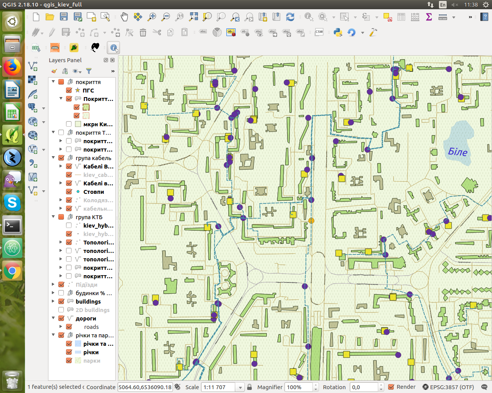
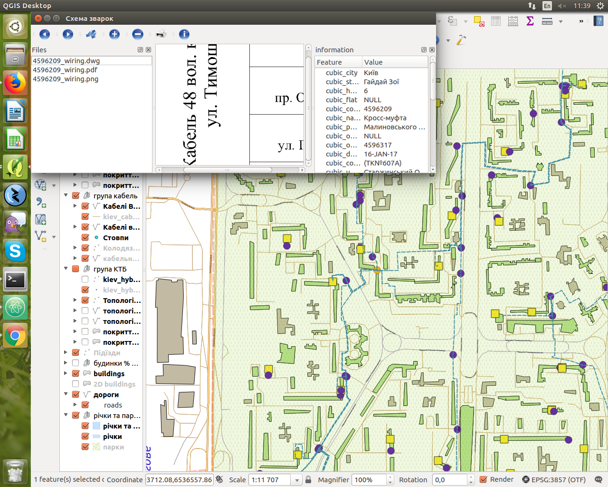
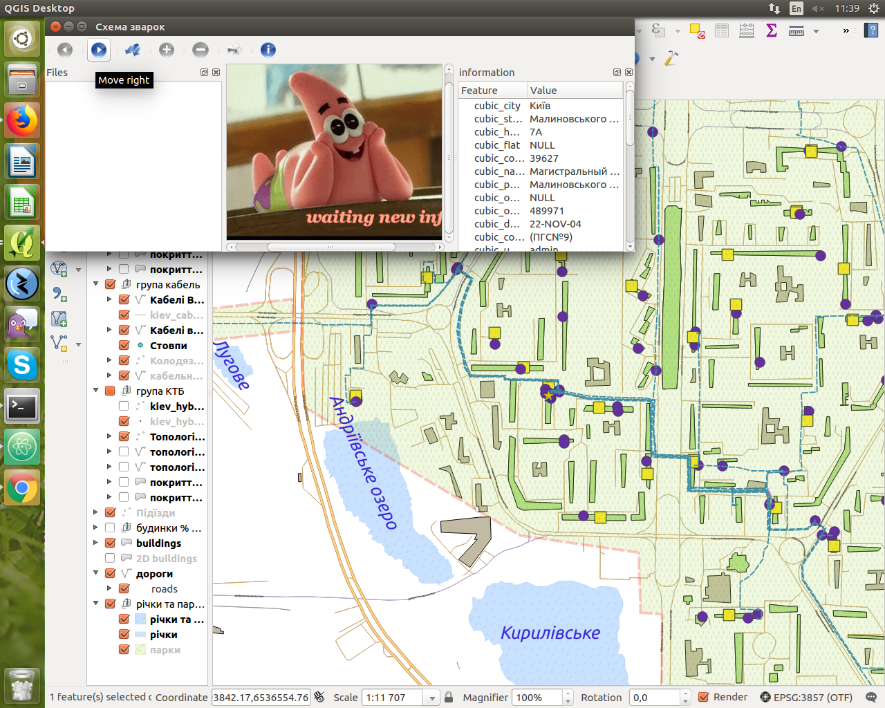

# python-plagin-for-qgis
  Web site: https://www.qgis.org/en/site/
  
  MuftInfo plagin written on a python for qgis
  
  This plugin is used to check/change Layout scheme of CTV objects OR to check detailed pits info.
  The main task is to search information in the database PostgreSQL and show user. After clicking on the item,the json file is being searched. This file contains information about 'Схема зварок'.

If the information is missing about 'Схема зварок' then some photo is loaded

